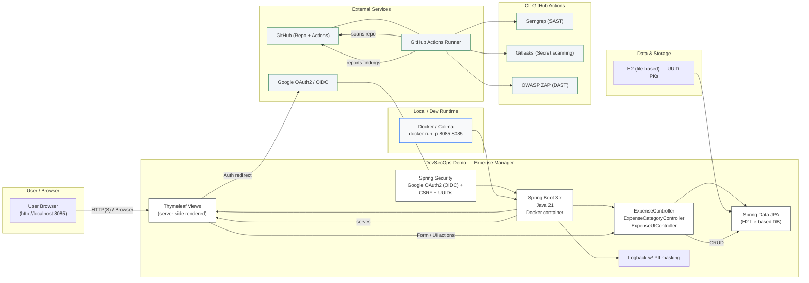

```mermaid
flowchart LR
  %% === Actors / Users ===
  subgraph Client["User / Browser"]
    A["User Browser<br/>(http://localhost:8085)"]
  end

  %% === App / Monolith ===
  subgraph App["DevSecOps Demo — Expense Manager"]
    direction TB
    Srv[Spring Boot 3.x<br/>Java 21<br/>Docker container]
    UI["Thymeleaf Views<br/>(server-side rendered)"]
    Controllers[ExpenseController<br/>ExpenseCategoryController<br/>ExpenseUIController]
    Sec["Spring Security<br/>Google OAuth2 (OIDC) + CSRF + UUIDs"]
    Repo["Spring Data JPA<br/>(H2 file-based DB)"]
    LogConfig[Logback w/ PII masking]
    Srv --> UI
    Srv --> Controllers
    Controllers --> Repo
    Srv -->|serves| UI
    Srv --> LogConfig
    Sec --> Srv
  end

  %% === Local Runtime / Container ===
  subgraph LocalRuntime["Local / Dev Runtime"]
    direction LR
    Docker[Docker / Colima<br/>docker run -p 8085:8085]
    Docker --> Srv
  end

  %% === Data Layer ===
  subgraph Data["Data & Storage"]
    H2["H2 (file-based) — UUID PKs"]
    H2 --> Repo
  end

  %% === External Integrations ===
  subgraph External["External Services"]
        Google[Google OAuth2 / OIDC]
    GitHub["GitHub (Repo + Actions)"]
    Google --- Sec
    GitHub --- CI_Run

  end

  %% === CI/CD / DevSecOps Scans ===
  subgraph CI["CI: GitHub Actions<br>"]
    direction TB
    CI_Run[GitHub Actions Runner]
    Semgrep["Semgrep (SAST)<br/>"]
    Gitleaks["Gitleaks (Secret scanning)"]
    ZAP["OWASP ZAP (DAST)"]
    CI_Run --> Semgrep
    CI_Run --> Gitleaks
    CI_Run --> ZAP
  end


  %% === Flows ===
  A -->|"HTTP(S) / Browser"| UI
  UI -->|Form / UI actions| Controllers
  Controllers -->|CRUD| Repo
  UI -->|Auth redirect| Google
  CI_Run -->|scans repo| GitHub
  CI_Run -->|reports findings| GitHub

  %% === Styling / Legend ===
  classDef infra fill:#f8f9fa,stroke:#0b5fff,stroke-width:1px;
  classDef app fill:#ffffff,stroke:#1f2937,stroke-width:1px;
  classDef ext fill:#f1f5f9,stroke:#0b6a3a,stroke-width:1px;

  class UI app
class Controllers app
class Sec app
class Repo app
class Srv app

class Docker infra

class Google ext
class GitHub ext
class CI_Run ext
class Semgrep ext
class Gitleaks ext
class ZAP ext

```